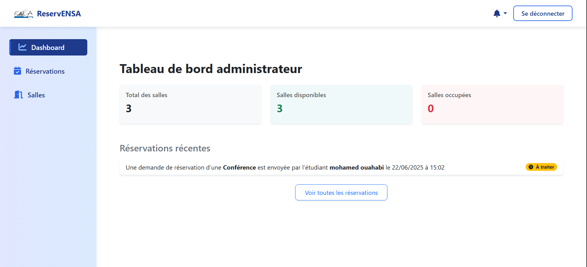

# SYSTEM-RESERVATION

## Introduction

SYSTEM-RESERVATION is a web application built with the Laravel framework that facilitates the reservation of spaces (salles, conférences, amphithéâtres). The system provides separate interfaces for administrators and students, allowing for efficient management of available locaux and reservations.

### 👩‍💻 Membres du Groupe

* **Oussama EL_BATTEOUI**
* **Basma EL HLAFI**
* **Maryem EL YAZGHI**
* **Soukayna EL FERCHOUNI**
* **Zakaria FAROUK**

## Technologies Used

*   **Framework:** Laravel
*   **Language:** PHP
*   **Database:** MySQL
*   **Frontend:** Blade, Bootstrap, JavaScript

## Login Information

For initial testing after seeding the database, you can use the following credentials:

*   **Admin:** Email: `admin@ensa.ma`, Password: `password`
*   **Student:** Email: `mohamed@etu.uae.ac.ma`, Password: `password`

## Features

**Admin Features:**

*   Admin Login and Logout
*   Admin Dashboard (overview of locaux and recent reservations)
*   Manage Locaux (view, add, edit, delete spaces)
*   Manage Reservations (view all reservations, validate or refuse pending reservations)

**Student Features:**

*   Student Login and Logout
*   Student Dashboard (view upcoming reservations)
*   View Available Locaux (search by date, time, type, and name)
*   Create New Reservations
*   Cancel Pending Reservations

## Database Schema

*   `utilisateurs`: Stores user information (name, email, password, role).
*   `admins`: Links users with the 'admin' role to additional admin-specific data (currently just `utilisateur_id`).
*   `etudiants`: Links users with the 'etudiant' role to student-specific data (`utilisateur_id`, `code`).
*   `locaux`: Stores information about reservable spaces (nom, type, capacite, status - libre/occupé).
*   `reservations`: Records reservation details (date, heure_debut, heure_fin, statut - en attente/accepte/refuse/termine, motif_reservation, motif_refus, message_annulation, etudiant_id, local_id).

## Installation

## Prerequisites
Before you can install and run SYSTEM-RESERVATION, ensure you have the following software and tools installed on your system:
*   **PHP:** Version specified in `composer.json` (usually 7.4 or higher).
*   **Composer:** For managing PHP dependencies.
*   **Node.js:** For managing frontend dependencies.
*   **npm:** Node package manager (comes with Node.js).
*   **Database Server:** Such as MySQL or PostgreSQL.

1.  **Clone the repository:**

git clone https://github.com/batteoui123/system-reservation.git

2.  **Navigate to the project directory:**

cd SYSTEM-RESERVATION

3.  **Install PHP dependencies:**

composer install

4.  **Install Node.js dependencies:**

npm install

5.  **Copy the example environment file and configure your database:**

cp .env.example .env

Edit the `.env` file with your database credentials and other environment-specific settings.

DB_CONNECTION=mysql
DB_HOST=127.0.0.1
DB_PORT=3306
DB_DATABASE=YOUR_DATABASE_NAME
DB_USERNAME=YOUR_USERNAME
DB_PASSWORD=YOUR_PASSWORD

6.  **Generate the application key:**

php artisan key:generate

7.  **Run database migrations:**

php artisan migrate

8.  **Seed the database (optional, but recommended for initial setup):**

php artisan db:seed

This will populate the `utilisateurs`, `admins`, `etudiants`, and `locaux` tables with some initial data. You can find the seeders in `database/seeders/`.

9.  **Run the application:**

php artisan serve

This will start the development server, and you can access the application in your web browser, typically at `http://localhost:8000`.

## Functionalities and Screenshots

This section outlines the key functionalities of the SYSTEM-RESERVATION application. After setting up and running the application, you can capture screenshots of these features and add them here.

### Authentication

The application provides separate login interfaces for administrators and students.

*   **Admin Login:**
    *   Accessible via the `/login-admin` route.
    *   Uses email and password for authentication.
    *   Redirects to the admin dashboard upon successful login.

    

*   **Student Login:**
    *   Accessible via the `/login-etudiant` route.
    *   Uses email and password for authentication.
    *   Redirects to the student dashboard upon successful login.

    

*   **Logout:**
    *   Both admin and student users can log out.

 ### Admin Panel

Administrators have full control over the application's data and settings.

*   **Admin Dashboard:**
    *   Provides an overview of the system, including the total number of locaux, available locaux, occupied locaux, and recent reservations.

    

*   **Manage Locaux:**
    *   Admins can view a list of all reservable spaces (locaux).
    *   They can add new locaux, specifying the name, type (Salle, Conférence, Amphi), and capacity.
    *   Existing locaux can be edited or deleted.

    
    
    
    

*   **Manage Reservations:**
    *   Admins can view all reservations made by students.
    *   They can filter reservations by date and status (en attente, accepte, refuse, termine).
    *   Admins can validate or refuse pending reservations. When refusing, they can provide a reason.

    
    
    
    

### Student Panel

Students can view available locaux and manage their own reservations.

*   **Student Dashboard:**
    *   Displays the student's upcoming reservations, excluding those that are finished.

    

*   **View Available Locaux:**
    *   Students can search for available locaux based on date, start time, end time, type, and name.
    *   The search results show the available locaux for the specified criteria.

    
    

*   **Create New Reservations:**
    *   From the available locaux list, students can initiate a reservation for a specific local.
    *   They provide the desired date, time slot, and a reservation motive.
    *   The system validates the reservation request, checking for time conflicts and ensuring the reservation is made at least 24 hours in advance.

    
    
    

*   **Cancel Pending Reservations:**
    *   Students can cancel their pending reservations from their dashboard.

    

## Development Notes

*   The application uses Blade templating engine for views.
*   Controllers are located in `app/Http/Controllers`.
*   Models are in `app/Models`.
*   Database migrations are in `database/migrations`.
*   Database seeders are in `database/seeders`.
*   Web routes are defined in `routes/web.php`, and API routes in `routes/api.php`.
*   Authentication logic is handled by the `AuthController`.
*   Admin-specific logic is in `AdminController`.
*   Reservation logic is in `ReservationController`.
*   Local-related logic is in `locauxController`.
*   Middleware for authentication and other http handling are in `app/Http/Middleware`.

## Version
*  **Version: 1.0.0**
   * Initial release of SYSTEM-RESERVATION with core admin and student functionalities, including locaux management, reservation system, and separate dashboards.
